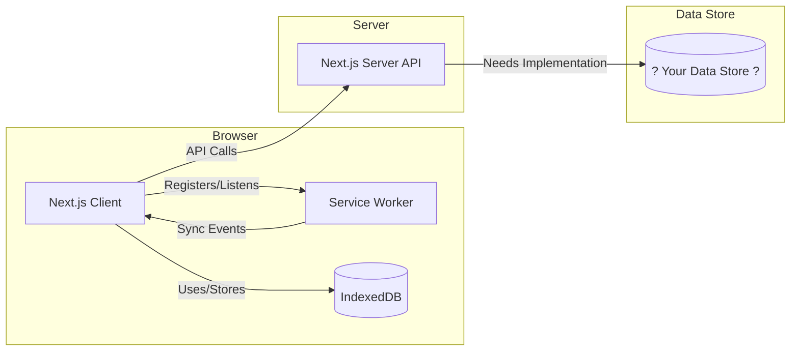

# Offline Notes App - Interview Task

## 1. How to Run the App

This application is built using Next.js.

1.  **Clone/Fork:**
    ```bash
    git clone https://github.com/ksajalk1/offline-notes-test
    cd offline-notes-test
    ```
2.  **Install Dependencies:**
    ```bash
    npm install
    # or
    yarn install
    ```
3.  **Run Development Server:**
    ```bash
    npm run dev
    # or
    yarn dev
    ```
    Open [http://localhost:3000](http://localhost:3000) in your browser.

## 2. Current Architecture

This is a note-taking application designed to work offline first.

**Key Components:**

*   **Frontend:** Built with [Next.js](https://nextjs.org/), [React](https://reactjs.org/), and [TypeScript](https://www.typescriptlang.org/).
*   **Offline Storage:** Uses the browser's **IndexedDB** to store notes locally. This allows the core functionality (create, read, update, delete notes) to work even when offline.
*   **Synchronization:**
    *   The app detects online/offline status using `navigator.onLine`.
    *   A **Service Worker** (`public/sw.js`, registered in `src/components/NoteList.tsx`) is set up to handle background sync events when the application comes online.
    *   The `refreshNotes` function in `src/utils/notes.ts` attempts to fetch data from the server API and reconcile local (IndexedDB) and server states.
*   **Backend API:** Next.js API routes are defined in `src/pages/api/`. These are intended to interact with a persistent data store.
*   **UI:** Basic React components located in `src/components`.

**What Works:**

*   Creating, viewing, editing, and deleting notes while offline. Changes are saved to IndexedDB.
*   Basic detection of online/offline status.
*   The framework for triggering synchronization exists (Service Worker, `refreshNotes` function).

**What's Missing:**

*   **Backend Data Store Implementation:** The API routes (`src/pages/api/notes.js`, `save-note.js`, `edit-note.js`, `delete-note.js`) currently contain **placeholder comments** (`// TODO: Implement logic...`). **There is no actual database or persistent storage connected on the backend.** These API routes need to be implemented to interact with a data store of your choice.

**Architecture Diagram:**



## 3. Your Tasks

Your goal is to enhance this application by implementing the backend data store and adding new features. Create a fork of this repository and implement the following tasks on your fork.

**Requirements:**

0. **Implement the Backend Data Store:**
    - **This is the foundational task.** Choose a data store for the backend (e.g., MongoDB, PostgreSQL, SQLite, or even a simple JSON file if you want).
    - Implement the logic within the placeholder comments in the API routes (`src/pages/api/notes.js`, `save-note.js`, `edit-note.js`, `delete-note.js`) to perform the necessary CRUD operations (Create, Read, Update, Delete) using your chosen data store.
    -   Ensure the API routes correctly interact with the client-side expectations (e.g., `save-note.js` should return the ID assigned by your data store).

1. **Tag Implementation:**
    -   Allow users to add/remove simple string tags to individual notes. You can choose the UI for adding/displaying tags (e.g., input field, predefined list).
    -   Store the tag data associated with each note (this should work with both your backend data store and the local IndexedDB storage).

2. **Filtering Implementation:**
    -   Provide a UI mechanism (e.g., dropdown, checkboxes) to allow users to select one or more tags to filter the main note list.
    -   The filtering logic must operate purely on the **client-side** based on the notes currently loaded/available locally in IndexedDB.

3. **State Management Constraint:**
    -   Implement all required state management for the tagging and filtering features using **native React hooks** (`useState`, `useEffect`, `useCallback`, `useContext` etc.). Do **not** use external state management libraries like Redux, Zustand, etc.

4. **Conflict Detection:**
    -   Implement logic within `src/utils/notes.ts` (likely in `refreshNotes` or related functions) to detect potential conflicts. A conflict occurs when a note has been modified locally while offline *and* the same note has also been modified on the server (in the data store you implemented) since the last sync.
    -   Define what constitutes a "conflict" (e.g., different titles, different content/tags).
    -   **For this task, simply detecting and logging the conflict is sufficient.** You do *not* need to implement a full conflict resolution UI, but you should think about how you *would* resolve it (see Deliverables).

5. **UI Cleanup:**
    -   The current UI is very basic. Improve the visual presentation and user experience. You are encouraged to use **Tailwind CSS** (it's already installed) for styling, but you can also continue using styled-components if preferred. Make it look more polished.

**Deliverables:**

1.  A link to your Git repository (your fork) containing your completed implementation.
2.  **Crucially:** Update *this* `README.md` file in your repository to include:
    -   Details on the backend data store you chose and why. Add any necessary updates to the "How to Run" section based on your data store choice (e.g., specific environment variables).
    -   An explanation of how you managed the state for tagging and filtering.
    -   Details on how you integrated tag storage with both the backend and the existing offline IndexedDB mechanism. How did you structure the notes data with the tag data. What are the pros and cons for that structure.
    -   An explanation of your conflict detection logic (how you identify conflicting notes).
    -   A brief description of your proposed conflict *resolution* strategy (even though you don't need to implement the UI for it).
3. Feel free to update this codebase as you choose. If you want to update something or fix something, you can do that. Just document what you did.

Good luck!


<!-- Backend Data Store -->
PostgreSQL is a suitable choice for note apps due to its robust features, scalability, and data integrity. It offers advanced features like full-text search, JSON data types, and support for complex queries, making it suitable for storing and managing diverse note content and user interactions.
But we cant state that Postgres is absolute perfect choice for it, mongoDb would also work fine, In JD it was mentioned postgres, that was also a reason to choose Postgres

<!-- How to Run -->

1. Postgres Should Be Installed on Local Machine

2.  **Clone/Fork:**
    ```bash
    git clone https://github.com/ajayshirketech/offline-notes-test-main.git
    cd offline-notes-test
    ```

    Create .env file
    Add these variables

        POSTGRES_USER=postgres
        POSTGRES_PASSWORD=root
        POSTGRES_HOST=localhost
        POSTGRES_DATABASE=postgres
        POSTGRES_PORT=5432

3.  **Install Dependencies:**
    ```bash
    npm install
    # or
    yarn install
    ```
4.  **Run Development Server:**
    ```bash
    npm run dev
    # or
    yarn dev
    ```
    Open [http://localhost:3000](http://localhost:3000) in your browser.

<!-- Integrated Tags Storage -->

I Simply made a table in Db Store named "tags" if doesnt exist, kept few tagname in it, user can also add custom tags in table, while in offline mode user select predifined tags and once online note get sync to Db


<!-- Conflict Detection logic -->

In the refreshNotes function, I identify conflicting notes by comparing the local version of a note with the latest version from the server. Specifically, I look for notes where:

localNote.localEditSynced === false: This indicates that the note has been edited locally and hasn't been synced with the server yet.

I then find the corresponding server note using _id and compare the server note's title with the lastSyncedTitle stored in the local note.

If there's a mismatch between the lastSyncedTitle and the current title on the server, it suggests that both the client and the server have diverged since the last sync, indicating a conflict.


<!-- Conflict Resolution Strategy -->

In the event of a detected conflict, I propose a manual resolution strategy where the user is presented with both versions of the note:
Server version: The latest version from the server.
Local version: The user's unsynced edits.
Optionally, a merged suggestion can be generated automatically to assist the user.
The UI would then allow the user to:
Choose which version to keep (local/server),
Or edit and save a merged version.
Until a resolution is made, the note would be marked with a conflict: true flag in local storage and on the server (once implemented), to avoid accidental overwrites.